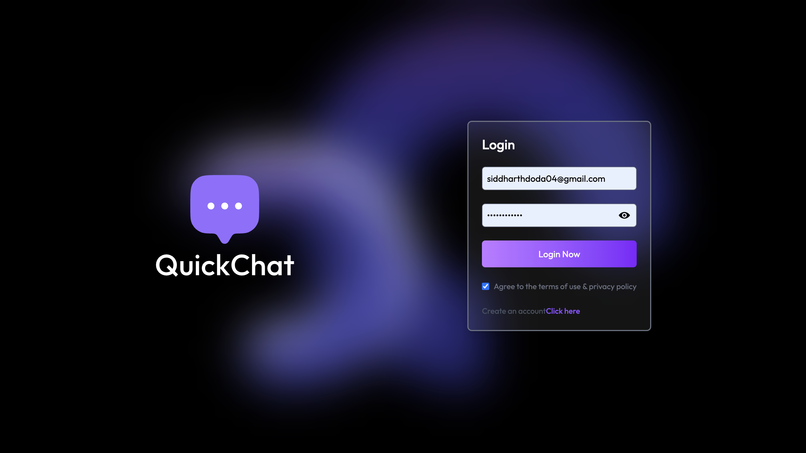
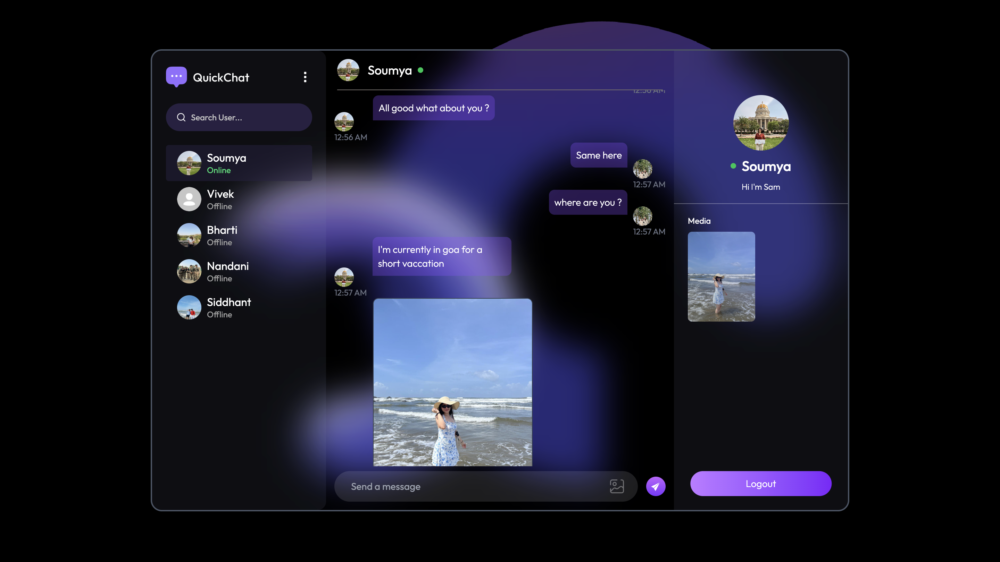
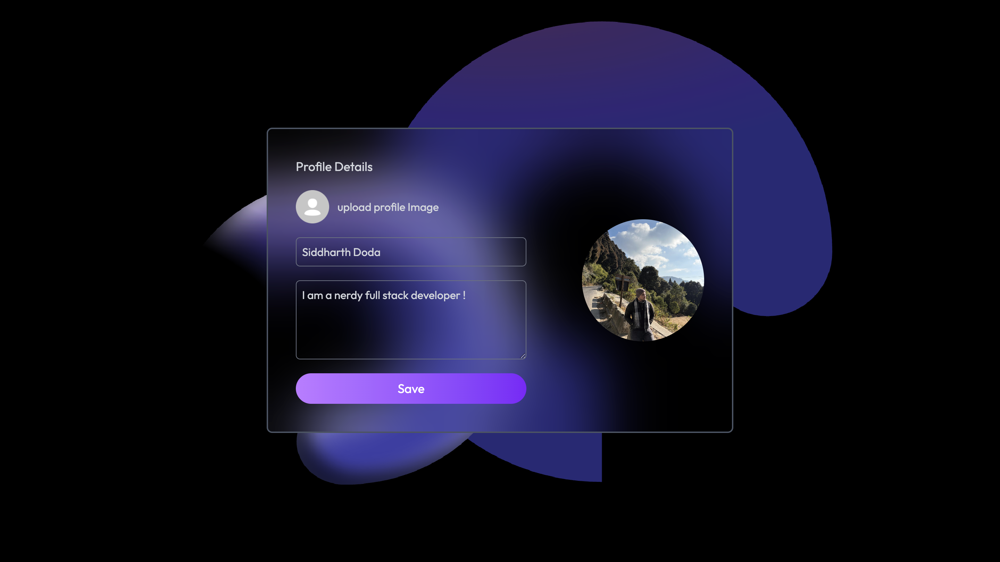

# QuickChat 💬

QuickChat is a real-time chat application built to make conversations fast, simple, and smooth. The goal was to create something that feels like modern messaging apps — instant updates, clean UI, and reliable backend handling while keeping the codebase scalable and easy to understand.

This project helped me understand how real-time systems actually work behind the scenes, especially with WebSockets and session handling.

## Features

- Real-time messaging using Socket.IO for instant communication  
- Secure user authentication with session-based login system  
- One-to-one chat with persistent message storage in MongoDB  
- Image sharing support using Multer and Cloudinary integration  
- Clean, responsive UI with a scalable backend structure (routes, controllers, middleware)  

## Why I built this

I wanted to go beyond basic CRUD apps and build something that actually feels “live”. Chat apps are a perfect way to understand:

- Real-time communication  
- State synchronization between users  
- Backend architecture at scale  
- Handling multiple users concurrently  

## 🛠 Tech Stack

**Frontend:**  React, Tailwind CSS, Axios  

**Backend:** Node.js, Express.js, Socket.IO, Multer (file uploads)  

**Database:** MongoDB, Mongoose  

**Authentication & Sessions:** Express Session, connect-mongo (MongoDB session store), bcrypt (password hashing)  

**Other Tools & Utilities:** 
dotenv (environment variables), CORS, Nodemon(development) 

## Screenshots

### Login / Signup

### Chat Interface

### Profile Details

## How it works

- When a user logs in, a session is created and stored in MongoDB  
- Socket.IO establishes a persistent connection between client and server  
- When a message is sent:  
  - It is emitted via socket  
  - Stored in the database  
  - Instantly delivered to the receiver  
- If the receiver is offline, messages are fetched when they reconnect  

## Deployment

- Frontend → Vercel
- Backend → Render 

## Final thoughts

This project was a big step forward for me in understanding how real-time applications actually work. It’s not just about sending messages — it’s about managing connections, syncing data, and making everything feel instant.
